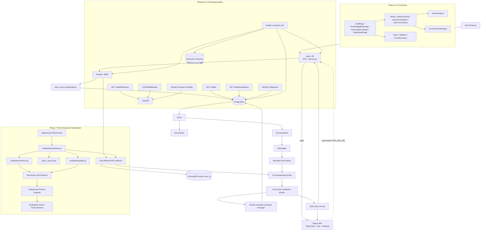

# System Architecture

> Status: reflects the implemented Phase 12 Modular Architecture & Refactoring alongside all previous phases (authenticated RAG, persistent conversations, streaming, evaluation, productionization, frontend foundation, RAG workspace, production-quality UI).

## Frontend Layer (Phase 9–11)

The browser app lives in `frontend/`. **Phase 9** shipped the three-column
shell, auth foundation, routing, and reusable components. **Phase 10**
added the data hooks (`useDocuments`, `useConversations`, `useConversation`),
the SSE streaming client (`services/streaming.ts`), and wired the real
backend flows. **Phase 11** makes the frontend production-quality: a global
toast system, skeleton loaders, an error boundary, a friendly error
mapper, 401-driven auto-logout, smart chat auto-scroll, accessibility
polish, and a multi-stage Docker image served by nginx with a `/api/*`
reverse proxy so the browser sees a single origin.

The browser only knows the public API URL (`VITE_API_URL`). In the docker
stack that URL is `/api` — nginx rewrites it to the FastAPI service so
the browser sees one origin.

## Authentication and Ownership

`auth_service.get_current_user` validates the signed Bearer token and loads the user. Every conversation query includes both its ID and that user ID. A message is created only after its parent conversation is owner-verified, so one user cannot read, send messages to, or delete another user's conversation.

## Conversation Persistence

PostgreSQL stores `Conversation` (`user_id`, title, timestamps) and `Message` (`conversation_id`, role, content, timestamp). One user has many conversations and one conversation has many messages. SQLAlchemy cascade deletion and database foreign keys with `ON DELETE CASCADE` remove messages when an owned conversation is deleted.

## Conversational RAG

`conversation_routes.py` persists the user message, reads only the configured recent history, and calls `chat_service.py`. That service retrieves user-filtered document chunks and keeps the two prompt sections separate: conversation history provides continuity; retrieved document context provides document evidence.

## Streaming and Persistence

`llm_service.stream_chat_answer()` uses the OpenAI Responses streaming API. The route transforms genuine `response.output_text.delta` events into `text/event-stream` SSE `token` events. It accumulates those deltas, writes the assistant message only after the stream completes, then emits `sources` and `done`. A failed generation or database write emits an SSE `error` event and no assistant message is stored.

## RAG Evaluation Subsystem (Phase 7)

`evaluation/evaluate.py` provides off-line quality assessment of retrieval and generation. It loads a version-controlled benchmark dataset (`dataset.json`) containing factual, multi-step, contextual, unanswerable, and ambiguous test cases. It reuses `retrieval_service` and `query_service` to measure Recall@K, Precision@K, Hit Rate@K, MRR@K, deterministic answer/grounded relevance, and optional 1-5 LLM-as-a-Judge ratings (`judge.py`). Reports are written to `evaluation/reports/latest_report.json` with baseline parameters and categorized failure analysis.

## Productionization Layer (Phase 8)

### Environment and Dependency Management
`config.py` centralises all environment variables. `requirements.txt` locks package versions for reproducible builds locally and in Docker.

### Containerization
`backend/Dockerfile` builds a `python:3.11-slim` image running Uvicorn. `backend/.dockerignore` excludes `env/`, `.env`, `storage/`, `chroma_data/`, and `__pycache__`. Root `docker-compose.yml` orchestrates the `web` (FastAPI) and `db` (PostgreSQL 16) containers with named volumes for data persistence.

### Database Migrations
`backend/alembic/` manages versioned schema migrations. `alembic upgrade head` applies all pending revisions. The initial migration `001_initial_schema.py` creates the `users`, `documents`, `conversations`, and `messages` tables.

### Health Probes
- `GET /health/liveness` — always returns `200 alive` if the process is running.
- `GET /health/readiness` — returns `200 ready` only when PostgreSQL responds to `SELECT 1`; returns `503` otherwise.
- `GET /health` — aggregates DB and storage filesystem checks.

### Security and Observability
- `CORSMiddleware` restricts browser requests to allowed origins only.
- Global `exception_handler` masks raw tracebacks from API responses while logging full details server-side.
- Structured `logging` with configurable `LOG_LEVEL`; upload filenames sanitized with `os.path.basename` to prevent path traversal.

## Implemented Boundaries

There is no Redis, Celery, background worker, advanced cache, Kubernetes, agent, MCP, OAuth, or multi-agent workflow. The platform is **deployment-ready** (fully containerized and migration-managed) but active cloud deployment is left to the operator.

