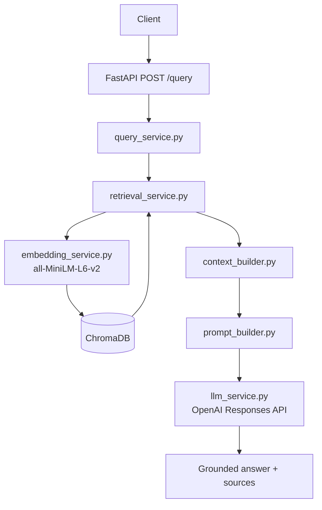

# System Architecture

> Status: reflects the implemented Phase 4 ingestion and question-answering paths.

## Ingestion Path

```text
Document → Text Extraction → Chunking → Local Embeddings → ChromaDB
```

`ingestion.py` coordinates this Phase 3 path. PostgreSQL stores document metadata/status/extracted text, local storage stores the original files, and ChromaDB persists chunk vectors plus source metadata.

## Query / RAG Path



### FastAPI and Query Service

`POST /query` validates the request and maps internal failures to safe HTTP responses. `query_service.py` orchestrates retrieval, context construction, prompt creation, and answer generation without exposing ChromaDB responses or embeddings.

### Question Embedding and ChromaDB

The question is embedded through the same cached `all-MiniLM-L6-v2` service used for document chunks. `vector_store.search_chunks()` queries the persisted `document_chunks` collection in cosine space and keeps the option for later internal document filtering.

### Context and LLM

Only top-K chunks meeting `SIMILARITY_THRESHOLD` are considered. `context_builder.py` keeps the highest-ranked source-labelled chunks that fit within `MAX_CONTEXT_LENGTH`. `llm_service.py` is a small provider boundary configured initially for OpenAI’s Responses API; its API key is read only from environment configuration.

### Response Sources

The response returns the source chunk’s `document_id`, `filename`, `chunk_index`, and similarity. `page_number` is omitted unless that metadata exists in ChromaDB; current ingestion does not create it.

## Implemented Boundaries

There is no authentication, user-specific filter, chat history, streaming, agent, MCP, queue, Docker, deployment, or evaluation framework. Phase 4 adds one stateless query endpoint only.
